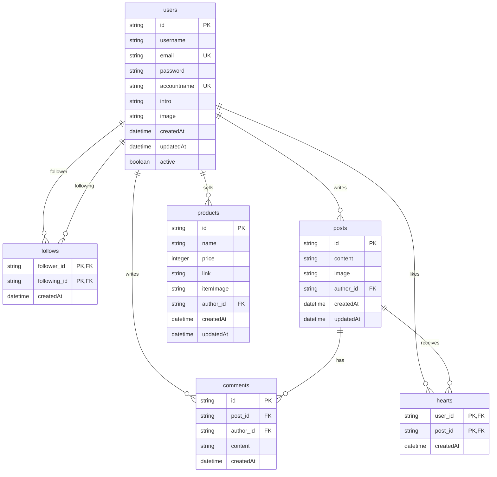

# 금방내방(Soon My Room) 백엔드 서버

## 프로젝트 개요

- 금방내방(Soon My Room) 서비스의 백엔드 서버가 중단되어 기능 동작이 불가능한 상태
- 기존 문서 스펙을 유지하면서 새로운 백엔드 서버 개발 진행 중
- 현대적인 기술 스택과 AWS 클라우드 인프라를 활용한 확장 가능하고 유지보수가 용이한 백엔드 시스템

## 배포 정보

🚀 **API 서버가 Railway에 배포되었습니다!**

- **API 엔드포인트**: [https://soonmyroomapi-production.up.railway.app](https://soonmyroomapi-production.up.railway.app)
- **API 문서 (Swagger UI)
  **: [https://soonmyroomapi-production.up.railway.app/swagger-ui/index.html](https://soonmyroomapi-production.up.railway.app/swagger-ui/index.html)

## 기술 스택

### 백엔드 환경

- **Java**: JDK 21
- **프레임워크**: Spring Boot 3.4.3
- **빌드 도구**: Gradle 8.13
- **데이터베이스**: AWS RDS PostgreSQL
- **파일 스토리지**: AWS S3
- **코드 스타일**: Google Java Format (Spotless 적용)
- **컨테이너화**: Docker
- **배포 플랫폼**: Railway

### AWS 인프라

- **AWS RDS**: PostgreSQL 데이터베이스 호스팅
- **AWS S3**: 이미지 파일 저장 및 관리
    - 프로필 이미지 버킷
    - 게시글 이미지 버킷
    - 상품 이미지 버킷
    - 기본 이미지 버킷

### 주요 의존성

- **Spring Boot Starter Web**: RESTful API 구현
- **Spring Boot Starter Data JPA**: 데이터 액세스 계층
- **Spring Boot Starter Security**: 인증 및 권한 관리
- **Spring Boot Starter Validation**: 데이터 유효성 검증
- **AWS S3 SDK**: AWS S3와 연동하여 이미지 파일 관리
- **JWT**: 사용자 인증 토큰 관리 (jjwt 0.12.6)
- **SpringDoc OpenAPI**: API 문서화 (Swagger UI)
- **Lombok**: 반복 코드 제거
- **PostgreSQL**: AWS RDS PostgreSQL 연결 드라이버

## 데이터베이스 구조



## 프로젝트 구조

```
src/
├── main/
│   ├── java/com/soon_my_room/soon_my_room/
│   │   ├── config/           # 스프링 설정 (보안, S3, Swagger 등)
│   │   ├── controller/       # API 엔드포인트 정의
│   │   ├── dto/              # 데이터 전송 객체
│   │   ├── model/            # 엔티티 모델
│   │   ├── exception/        # 예외 처리
│   │   ├── repository/       # 데이터 액세스 계층
│   │   ├── security/         # JWT 인증 및 보안 처리
│   │   └── service/          # 비즈니스 로직
│   └── resources/
│       ├── application.properties      # 기본 애플리케이션 설정
│       ├── application-dev.properties  # 개발 환경 설정
│       └── application-prod.properties # 운영 환경 설정
└── test/                     # 테스트 코드
```

## 설치 및 실행 방법

### 선행 조건

- JDK 21 이상
- Gradle 8.x 이상
- AWS 계정 및 필요한 서비스 접근 권한
    - AWS RDS PostgreSQL 인스턴스
    - AWS S3 버킷 및 접근 키

### AWS 설정

#### AWS RDS 설정

1. AWS Management Console에서 RDS 서비스 접속
2. PostgreSQL 데이터베이스 인스턴스 생성
3. 보안 그룹 설정으로 적절한 인바운드 규칙 구성
4. 데이터베이스 연결 정보(엔드포인트, 사용자 이름, 비밀번호) 확보

#### AWS S3 설정

1. AWS Management Console에서 S3 서비스 접속
2. 다음 버킷 생성:
    - 프로필 이미지용 버킷 (예: `soon-my-room-profiles`)
    - 게시글 이미지용 버킷 (예: `soon-my-room-posts`)
    - 상품 이미지용 버킷 (예: `soon-my-room-products`)
    - 기본 이미지용 버킷 (예: `soon-my-room-default`)
3. 각 버킷에 대한 적절한 접근 정책 설정
4. CORS 설정 구성
5. IAM 사용자 생성 및 S3 접근 권한 부여
6. 접근 키(Access Key)와 비밀 키(Secret Key) 발급

### 환경 설정

1. 프로젝트 클론:
   ```bash
   git clone https://github.com/soon-my-room/soon_my_room_backend.git
   cd soon_my_room_backend
   ```

2. 환경 변수 설정:
   `.env` 파일을 생성하고 다음 변수들을 설정합니다 (`.env.example` 참조):
   ```
   JWT_SECRET=your_jwt_secret_here
   JWT_EXPIRATION=86400000
   
   # AWS RDS 설정
   DB_URL=jdbc:postgresql://your-rds-instance.rds.amazonaws.com:5432/your_db_name
   DB_USERNAME=your_db_username
   DB_PASSWORD=your_db_password
   
   # AWS S3 설정
   AWS_S3_REGION=ap-northeast-2
   AWS_S3_ACCESS_KEY=your_aws_access_key
   AWS_S3_SECRET_KEY=your_aws_secret_key
   AWS_S3_BUCKET_PROFILES=soon-my-room-profiles
   AWS_S3_BUCKET_POSTS=soon-my-room-posts
   AWS_S3_BUCKET_PRODUCTS=soon-my-room-products
   AWS_S3_BUCKET_DEFAULT=soon-my-room-default
   ```

### 빌드 및 실행

```bash
# 프로젝트 빌드
./gradlew build

# 코드 스타일 적용
./gradlew spotlessApply

# 서버 실행 (개발 환경)
./gradlew bootRun --args='--spring.profiles.active=dev'

# 서버 실행 (운영 환경)
./gradlew bootRun --args='--spring.profiles.active=prod'
```

기본적으로 서버는 `http://localhost:9000`에서 실행됩니다.

## Docker를 통한 배포

### Docker 설정

프로젝트는 Docker를 사용하여 쉽게 배포할 수 있습니다. 다음 Docker 관련 파일들이 포함되어 있습니다:

- `Dockerfile`: 애플리케이션을 빌드하고 실행하기 위한 컨테이너 설정
- `docker-compose.dev.yml`: 개발 환경용 Docker Compose 설정
- `docker-compose.prod.yml`: 운영 환경용 Docker Compose 설정
- `.dockerignore`: Docker 빌드 시 제외할 파일 목록
- `script/docker-build.sh`: Docker 이미지 빌드 스크립트
- `script/docker-deploy.sh`: Docker 컨테이너 배포 스크립트

### Docker 이미지 빌드

```bash
# 스크립트에 실행 권한 부여
chmod +x script/docker-build.sh

# 개발 환경 이미지 빌드
./script/docker-build.sh dev

# 운영 환경 이미지 빌드
./script/docker-build.sh prod
```

빌드된 이미지는 다음 태그를 가집니다:

- 개발 환경: `soon-my-room-api:dev-latest`
- 운영 환경: `soon-my-room-api:prod-latest`

### Docker 컨테이너 배포

```bash
# 스크립트에 실행 권한 부여
chmod +x script/docker-deploy.sh

# 개발 환경 배포
./script/docker-deploy.sh dev

# 운영 환경 배포
./script/docker-deploy.sh prod
```

## API 문서

SpringDoc OpenAPI를 통해 자동 생성된 API 문서는 다음 URL에서 확인할 수 있습니다:

- **배포된 Swagger UI
  **: [https://soonmyroomapi-production.up.railway.app/swagger-ui/index.html](https://soonmyroomapi-production.up.railway.app/swagger-ui/index.html)
- **로컬 개발 환경 Swagger UI**: `http://localhost:9000/swagger-ui/index.html`
- **OpenAPI JSON**: `http://localhost:9000/v3/api-docs`

## 주요 API 엔드포인트

### 사용자 관리 ✅

- `POST /user`: 회원가입
- `POST /user/login`: 로그인
- `POST /user/accountnamevalid`: 계정명 유효성 검증
- `POST /user/emailvalid`: 이메일 유효성 검증
- `GET /user/checktoken`: 토큰 유효성 검증
- `GET /user/searchuser`: 사용자 검색

### 프로필 및 팔로우 ✅

- `PUT /user`: 프로필 수정
- `GET /profile/:accountname`: 프로필 조회
- `POST /profile/:accountname/follow`: 팔로우
- `DELETE /profile/:accountname/unfollow`: 언팔로우
- `GET /profile/:accountname/follower`: 팔로워 목록 조회
- `GET /profile/:accountname/following`: 팔로잉 목록 조회

### 이미지 관리 ✅

- `POST /image/uploadfile`: 단일 이미지 업로드
- `POST /image/uploadfiles`: 다중 이미지 업로드 (최대 3개)

### 게시물 관리 ✅

- `GET /post/feed`: 팔로잉 게시물 목록 조회 (피드)
- `POST /post`: 게시물 작성
- `GET /post/:postId`: 게시물 상세 조회
- `PUT /post/:postId`: 게시물 수정
- `DELETE /post/:postId`: 게시물 삭제
- `GET /post/:accountname/userpost`: 특정 사용자의 게시물 목록 조회
- `POST /post/:postId/report`: 게시물 신고

### 좋아요 관리 ✅

- `POST /post/:postId/heart`: 게시물 좋아요
- `DELETE /post/:postId/unheart`: 게시물 좋아요 취소

### 댓글 관리 ✅

- `GET /post/:postId/comments`: 댓글 목록 조회
- `POST /post/:postId/comments`: 댓글 작성
- `DELETE /post/:postId/comments/:commentId`: 댓글 삭제
- `POST /post/:postId/comments/:commentId/report`: 댓글 신고

### 상품 관리 ✅

- `GET /product/:accountname`: 상품 목록 조회
- `POST /product`: 상품 등록
- `GET /product/detail/:productId`: 상품 상세 조회
- `PUT /product/:productId`: 상품 정보 수정
- `DELETE /product/:productId`: 상품 삭제

## 개발 로드맵

1. **기초 설정** ✅
    - 프로젝트 구조 설정 및 의존성 관리
    - AWS RDS 데이터베이스 연결 및 JPA 설정
    - Spring Security 및 JWT 인증 구현
    - AWS S3 연동 및 이미지 관리 서비스 구현
    - CORS 설정 및 환경별 프로필 구성

2. **핵심 기능 개발** ✅
    - 사용자 관리 API (회원가입, 로그인) ✅
    - 프로필 관리 API ✅
    - 팔로우/팔로잉 기능 ✅
    - 이미지 업로드 기능 ✅
    - 게시물 관련 API ✅
    - 좋아요 기능 ✅
    - 댓글 관련 API ✅
    - 상품 등록 및 관리 API ✅
    - 사용자 검색 기능 ✅

3. **테스트 및 문서화** 🚧
    - 단위 테스트 및 통합 테스트 작성
    - API 문서화 완성 (Swagger) ✅
    - 개발 가이드 작성

4. **배포 및 모니터링** ✅
    - Docker 컨테이너화 ✅
    - CI/CD 파이프라인 구축
    - Railway 플랫폼을 통한 클라우드 배포 완료 ✅
    - 모니터링 및 로깅 설정

## 문제 해결

### AWS 관련 문제 해결

- **RDS 연결 오류**: 보안 그룹 설정을 확인하고, 적절한 인바운드 규칙이 구성되어 있는지 확인합니다.
- **S3 접근 오류**: IAM 권한 및 버킷 정책을 확인합니다. 접근 키와 비밀 키가 올바르게 설정되어 있는지 확인합니다.
- **S3 CORS 오류**: S3 버킷의 CORS 설정을 확인하고, 프론트엔드 도메인이 허용 목록에 있는지 확인합니다.

### Docker 관련 문제 해결

- **빌드 실패**: Spotless 스타일 검사가 실패하는 경우 `./gradlew spotlessApply` 명령으로 코드 스타일을 수정합니다.
- **컨테이너 시작 실패**: `docker logs soon-my-room-api-dev` 명령으로 로그를 확인합니다.
- **환경 변수 문제**: `docker-compose -f docker-compose.dev.yml config` 명령으로 환경 변수 설정을 확인합니다.

### 일반적인 문제 해결

- **빌드 오류**: Gradle 버전(8.x 이상) 및 JDK 버전(21 이상)을 확인합니다.
- **실행 오류**: 필요한 환경 변수가 모두 설정되어 있는지 확인합니다.
- **API 오류**: Swagger UI를 통해 API 스펙을 확인하고 올바른 요청 형식을 사용하고 있는지 검증합니다.

## 라이센스

이 프로젝트는 Apache License 2.0 하에 배포됩니다.

## 연락처

- 프로젝트 관리자: rlgns0610@gmail.com
- 이슈 트래커: https://github.com/qorlgns1/soon_my_room_api/issues