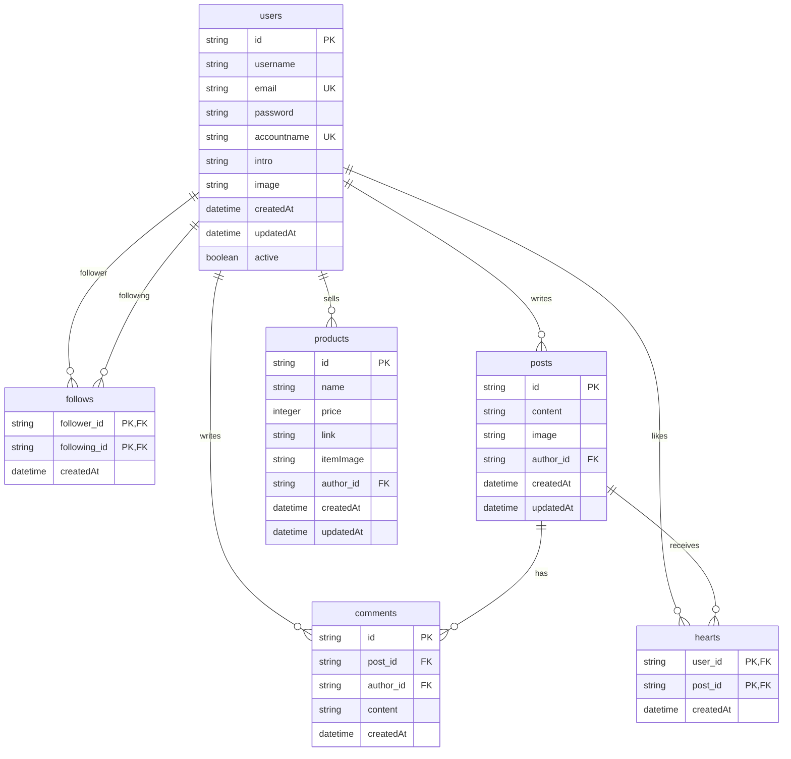

# 금방내방(Soon My Room) 백엔드 서버

## 프로젝트 개요

- 금방내방(Soon My Room) 서비스의 백엔드 서버가 중단되어 기능 동작이 불가능한 상태
- 기존 문서 스펙을 유지하면서 새로운 백엔드 서버 개발 진행 중
- 현대적인 기술 스택으로 기존 서비스의 기능을 새롭게 구현하여 지속 가능한 백엔드 시스템 구축

## 기술 스택

### 백엔드 환경

- **Java**: JDK 21
- **프레임워크**: Spring Boot 3.4.3
- **빌드 도구**: Gradle 8.13
- **데이터베이스**: PostgreSQL (Supabase)
- **코드 스타일**: Google Java Format (Spotless 적용)

### 주요 의존성

- **Spring Boot Starter Web**: RESTful API 구현
- **Spring Boot Starter Data JPA**: 데이터 액세스 계층
- **Spring Boot Starter Security**: 인증 및 권한 관리
- **Spring Boot Starter Validation**: 데이터 유효성 검증
- **JWT**: 사용자 인증 토큰 관리 (jjwt 0.12.6)
- **SpringDoc OpenAPI**: API 문서화 (Swagger UI)
- **Lombok**: 반복 코드 제거
- **PostgreSQL**: 관계형 데이터베이스

## 데이터베이스 구조



## 프로젝트 구조

```
src/
├── main/
│   ├── java/com/soon_my_room/soon_my_room/
│   │   ├── config/           # 스프링 설정 (보안, Swagger 등)
│   │   ├── controller/       # API 엔드포인트 정의
│   │   ├── dto/              # 데이터 전송 객체
│   │   ├── model/            # 엔티티 모델
│   │   ├── exception/        # 예외 처리
│   │   ├── repository/       # 데이터 액세스 계층
│   │   ├── security/         # JWT 인증 및 보안 처리
│   │   └── service/          # 비즈니스 로직
│   └── resources/
│       └── application.properties  # 애플리케이션 설정
└── test/                     # 테스트 코드
```

## 설치 및 실행 방법

### 선행 조건

- JDK 21 이상
- Gradle 8.x 이상
- PostgreSQL 데이터베이스

### 환경 설정

1. 프로젝트 클론:
   ```bash
   git clone https://github.com/soon-my-room/soon_my_room_backend.git
   cd soon_my_room_backend
   ```

2. 환경 변수 설정:
   `.env` 파일을 생성하고 다음 변수들을 설정합니다:
   ```
   JWT_SECRET=your_jwt_secret_here
   JWT_EXPIRATION=86400000
   DB_URL=jdbc:postgresql://your_db_host:5432/your_db_name
   DB_USERNAME=your_db_username
   DB_PASSWORD=your_db_password
   ```

### 빌드 및 실행

```bash
# 프로젝트 빌드
./gradlew build

# 서버 실행
./gradlew bootRun
```

기본적으로 서버는 `http://localhost:9000`에서 실행됩니다.

### 코드 스타일 적용

```bash
./gradlew spotlessApply
```

## API 문서

SpringDoc OpenAPI를 통해 자동 생성된 API 문서는 서버 실행 후 다음 URL에서 확인할 수 있습니다:

- Swagger UI: `http://localhost:9000/swagger-ui/index.html`
- OpenAPI JSON: `http://localhost:9000/v3/api-docs`

## 주요 API 엔드포인트

### 사용자 관리 ✅

- `POST /user`: 회원가입
- `POST /user/login`: 로그인
- `POST /user/accountnamevalid`: 계정명 유효성 검증
- `POST /user/emailvalid`: 이메일 유효성 검증

### 프로필 및 팔로우 ✅

- `PUT /user`: 프로필 수정
- `GET /profile/:accountname`: 프로필 조회
- `POST /profile/:accountname/follow`: 팔로우
- `DELETE /profile/:accountname/unfollow`: 언팔로우
- `GET /profile/:accountname/follower`: 팔로워 목록 조회
- `GET /profile/:accountname/following`: 팔로잉 목록 조회

### 게시물 관리 (개발 예정)

- `GET /post`: 게시물 목록 조회
- `POST /post`: 게시물 작성
- `GET /post/:postId`: 게시물 상세 조회
- `PUT /post/:postId`: 게시물 수정
- `DELETE /post/:postId`: 게시물 삭제

### 댓글 관리 (개발 예정)

- `GET /post/:postId/comments`: 댓글 목록 조회
- `POST /post/:postId/comments`: 댓글 작성
- `DELETE /post/:postId/comments/:commentId`: 댓글 삭제

### 상품 관리 (개발 예정)

- `GET /product`: 상품 목록 조회
- `POST /product`: 상품 등록
- `GET /product/:productId`: 상품 상세 조회
- `PUT /product/:productId`: 상품 정보 수정
- `DELETE /product/:productId`: 상품 삭제

## 개발 로드맵

1. **기초 설정** ✅
    - 프로젝트 구조 설정 및 의존성 관리
    - 데이터베이스 연결 및 JPA 설정
    - Spring Security 및 JWT 인증 구현

2. **핵심 기능 개발** 🚧
    - 사용자 관리 API (회원가입, 로그인) ✅
    - 프로필 관리 API ✅
    - 팔로우/팔로잉 기능 ✅
    - 게시물 및 댓글 관련 API
    - 좋아요 기능
    - 상품 등록 및 관리 API

3. **테스트 및 문서화** 🚧
    - 단위 테스트 및 통합 테스트 작성
    - API 문서화 완성 (Swagger) ✅
    - 개발 가이드 작성

4. **배포 및 모니터링** 📅
    - Docker 컨테이너화
    - CI/CD 파이프라인 구축
    - 클라우드 배포
    - 모니터링 및 로깅 설정

## 기여 방법

1. 프로젝트 포크
2. 기능 브랜치 생성 (`git checkout -b feature/amazing-feature`)
3. 변경사항 커밋 (`git commit -m 'Add some amazing feature'`)
4. 브랜치에 푸시 (`git push origin feature/amazing-feature`)
5. Pull Request 생성

## 라이센스

이 프로젝트는 Apache License 2.0 하에 배포됩니다.

## 연락처

- 프로젝트 관리자: rlgns0610@gmail.com
- 이슈 트래커: https://github.com/qorlgns1/soon_my_room_api/issues