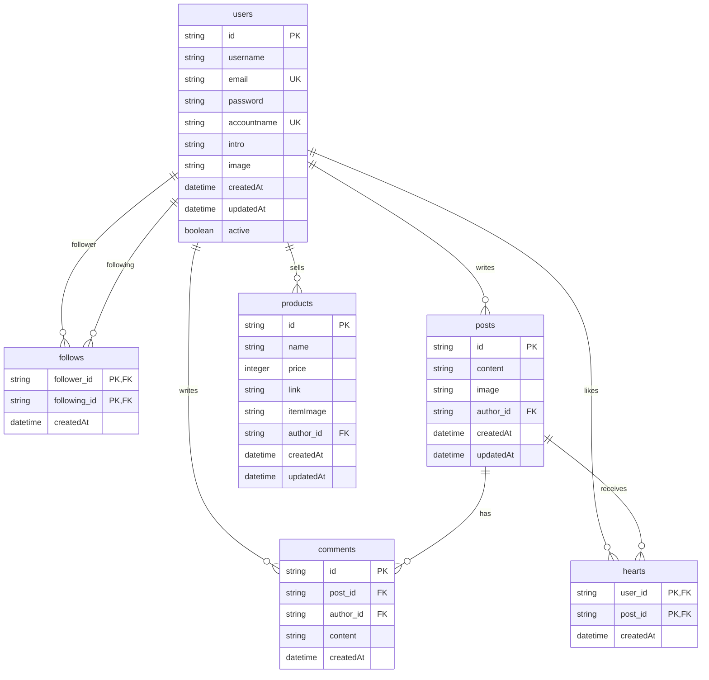

# 금방내방(Soon My Room) 백엔드 서버

## 프로젝트 개요

- 금방내방(Soon My Room) 서비스의 백엔드 서버가 중단되어 기능 동작이 불가능한 상태
- 기존 문서 스펙을 유지하면서 새로운 백엔드 서버 개발 진행 중
- 현대적인 기술 스택으로 기존 서비스의 기능을 새롭게 구현하여 지속 가능한 백엔드 시스템 구축

## 배포 정보

🚀 **API 서버가 Railway에 배포되었습니다!**

- **API 엔드포인트**: [https://soonmyroomapi-production.up.railway.app](https://soonmyroomapi-production.up.railway.app)
- **API 문서 (Swagger UI)
  **: [https://soonmyroomapi-production.up.railway.app/swagger-ui/index.html](https://soonmyroomapi-production.up.railway.app/swagger-ui/index.html)

## 기술 스택

### 백엔드 환경

- **Java**: JDK 21
- **프레임워크**: Spring Boot 3.4.3
- **빌드 도구**: Gradle 8.13
- **데이터베이스**: PostgreSQL (Supabase)
- **파일 스토리지**: Supabase Storage (S3 호환 API)
- **코드 스타일**: Google Java Format (Spotless 적용)
- **배포 플랫폼**: Railway

### 주요 의존성

- **Spring Boot Starter Web**: RESTful API 구현
- **Spring Boot Starter Data JPA**: 데이터 액세스 계층
- **Spring Boot Starter Security**: 인증 및 권한 관리
- **Spring Boot Starter Validation**: 데이터 유효성 검증
- **AWS S3 SDK**: Supabase Storage와 S3 호환 API 연동
- **JWT**: 사용자 인증 토큰 관리 (jjwt 0.12.6)
- **SpringDoc OpenAPI**: API 문서화 (Swagger UI)
- **Lombok**: 반복 코드 제거
- **PostgreSQL**: 관계형 데이터베이스

## 데이터베이스 구조



## 프로젝트 구조

```
src/
├── main/
│   ├── java/com/soon_my_room/soon_my_room/
│   │   ├── config/           # 스프링 설정 (보안, S3, Swagger 등)
│   │   ├── controller/       # API 엔드포인트 정의
│   │   ├── dto/              # 데이터 전송 객체
│   │   ├── model/            # 엔티티 모델
│   │   ├── exception/        # 예외 처리
│   │   ├── repository/       # 데이터 액세스 계층
│   │   ├── security/         # JWT 인증 및 보안 처리
│   │   └── service/          # 비즈니스 로직
│   └── resources/
│       ├── application.properties      # 기본 애플리케이션 설정
│       ├── application-dev.properties  # 개발 환경 설정
│       └── application-prod.properties # 운영 환경 설정
└── test/                     # 테스트 코드
```

## 설치 및 실행 방법

### 선행 조건

- JDK 21 이상
- Gradle 8.x 이상
- PostgreSQL 데이터베이스
- Supabase 프로젝트 (DB 및 Storage)

### 환경 설정

1. 프로젝트 클론:
   ```bash
   git clone https://github.com/soon-my-room/soon_my_room_backend.git
   cd soon_my_room_backend
   ```

2. 환경 변수 설정:
   `.env` 파일을 생성하고 다음 변수들을 설정합니다:
   ```
   JWT_SECRET=your_jwt_secret_here
   JWT_EXPIRATION=86400000
   DB_URL=jdbc:postgresql://your_db_host:5432/your_db_name
   DB_USERNAME=your_db_username
   DB_PASSWORD=your_db_password
   SUPABASE_ENDPOINT=https://your-project-id.supabase.co/storage/v1
   SUPABASE_REGION=your-supabase-region
   SUPABASE_ACCESS_KEY=your-supabase-access-key
   SUPABASE_SECRET_KEY=your-supabase-secret-key
   SUPABASE_BUCKET_PROFILES=user-profiles
   SUPABASE_BUCKET_POSTS=post-images
   SUPABASE_BUCKET_PRODUCTS=product-images
   SUPABASE_BUCKET_DEFAULT=default
   CORS_ALLOWED_ORIGINS=http://localhost:3000,https://soon-my-room.com
   ```

### Supabase 설정

1. Supabase 프로젝트 생성
2. 데이터베이스 연결 정보 획득
3. Storage 설정:
    - `user-profiles`, `post-images`, `product-images`, `default` 버킷 생성
    - 버킷 권한 설정 (RLS 정책 구성)
    - API 키 획득 (access key & secret key)

### 빌드 및 실행

```bash
# 프로젝트 빌드
./gradlew build

# 서버 실행 (개발 환경)
./gradlew bootRun --args='--spring.profiles.active=dev'

# 서버 실행 (운영 환경)
./gradlew bootRun --args='--spring.profiles.active=prod'
```

기본적으로 서버는 `http://localhost:9000`에서 실행됩니다.

### 코드 스타일 적용

```bash
./gradlew spotlessApply
```

## Docker를 통한 배포

### Docker 설정

프로젝트는 Docker를 사용하여 쉽게 배포할 수 있습니다. 다음 Docker 관련 파일들이 포함되어 있습니다:

- `Dockerfile`: 애플리케이션을 빌드하고 실행하기 위한 컨테이너 설정
- `docker-compose.dev.yml`: 개발 환경용 Docker Compose 설정
- `docker-compose.prod.yml`: 운영 환경용 Docker Compose 설정
- `.dockerignore`: Docker 빌드 시 제외할 파일 목록
- `script/docker-build.sh`: Docker 이미지 빌드 스크립트
- `script/docker-deploy.sh`: Docker 컨테이너 배포 스크립트

### Docker 이미지 빌드

```bash
# 스크립트에 실행 권한 부여
chmod +x script/docker-build.sh

# 개발 환경 이미지 빌드
./script/docker-build.sh dev

# 운영 환경 이미지 빌드
./script/docker-build.sh prod
```

빌드된 이미지는 다음 태그를 가집니다:

- 개발 환경: `soon-my-room-api:dev-latest`
- 운영 환경: `soon-my-room-api:prod-latest`

### Docker 컨테이너 배포

```bash
# 스크립트에 실행 권한 부여
chmod +x script/docker-deploy.sh

# 개발 환경 배포
./script/docker-deploy.sh dev

# 운영 환경 배포
./script/docker-deploy.sh prod
```

### Docker 컨테이너 관리

```bash
# 컨테이너 로그 확인
docker-compose -f docker-compose.dev.yml logs -f app  # 개발 환경
docker-compose -f docker-compose.prod.yml logs -f app  # 운영 환경

# 컨테이너 중지
docker-compose -f docker-compose.dev.yml down  # 개발 환경
docker-compose -f docker-compose.prod.yml down  # 운영 환경

# 컨테이너 재시작
docker-compose -f docker-compose.dev.yml restart app  # 개발 환경
docker-compose -f docker-compose.prod.yml restart app  # 운영 환경
```

### Docker 환경 최적화

운영 환경 Docker 구성은 다음과 같은 최적화가 포함되어 있습니다:

- 리소스 제한 설정: CPU 및 메모리 제한으로 컨테이너 리소스 관리
- 자동 재시작 정책: 서비스 중단 시 자동 복구
- 다중 단계 빌드: 작은 실행 이미지 크기
- 볼륨 마운트: 로깅을 위한 영구 저장소

## API 문서

SpringDoc OpenAPI를 통해 자동 생성된 API 문서는 다음 URL에서 확인할 수 있습니다:

- **배포된 Swagger UI
  **: [https://soonmyroomapi-production.up.railway.app/swagger-ui/index.html](https://soonmyroomapi-production.up.railway.app/swagger-ui/index.html)
- Swagger UI: `http://localhost:9000/swagger-ui/index.html`
- OpenAPI JSON: `http://localhost:9000/v3/api-docs`

## 주요 API 엔드포인트

### 사용자 관리 ✅

- `POST /user`: 회원가입
- `POST /user/login`: 로그인
- `POST /user/accountnamevalid`: 계정명 유효성 검증
- `POST /user/emailvalid`: 이메일 유효성 검증
- `GET /user/checktoken`: 토큰 유효성 검증
- `GET /user/searchuser`: 사용자 검색

### 프로필 및 팔로우 ✅

- `PUT /user`: 프로필 수정
- `GET /profile/:accountname`: 프로필 조회
- `POST /profile/:accountname/follow`: 팔로우
- `DELETE /profile/:accountname/unfollow`: 언팔로우
- `GET /profile/:accountname/follower`: 팔로워 목록 조회
- `GET /profile/:accountname/following`: 팔로잉 목록 조회

### 이미지 관리 ✅

- `POST /image/uploadfile`: 단일 이미지 업로드
- `POST /image/uploadfiles`: 다중 이미지 업로드 (최대 3개)

### 게시물 관리 ✅

- `GET /post/feed`: 팔로잉 게시물 목록 조회 (피드)
- `POST /post`: 게시물 작성
- `GET /post/:postId`: 게시물 상세 조회
- `PUT /post/:postId`: 게시물 수정
- `DELETE /post/:postId`: 게시물 삭제
- `GET /post/:accountname/userpost`: 특정 사용자의 게시물 목록 조회
- `POST /post/:postId/report`: 게시물 신고

### 좋아요 관리 ✅

- `POST /post/:postId/heart`: 게시물 좋아요
- `DELETE /post/:postId/unheart`: 게시물 좋아요 취소

### 댓글 관리 ✅

- `GET /post/:postId/comments`: 댓글 목록 조회
- `POST /post/:postId/comments`: 댓글 작성
- `DELETE /post/:postId/comments/:commentId`: 댓글 삭제
- `POST /post/:postId/comments/:commentId/report`: 댓글 신고

### 상품 관리 ✅

- `GET /product/:accountname`: 상품 목록 조회
- `POST /product`: 상품 등록
- `GET /product/detail/:productId`: 상품 상세 조회
- `PUT /product/:productId`: 상품 정보 수정
- `DELETE /product/:productId`: 상품 삭제

## 개발 로드맵

1. **기초 설정** ✅
    - 프로젝트 구조 설정 및 의존성 관리
    - 데이터베이스 연결 및 JPA 설정
    - Spring Security 및 JWT 인증 구현
    - Supabase Storage 연동
    - CORS 설정 및 환경별 프로필 구성

2. **핵심 기능 개발** ✅
    - 사용자 관리 API (회원가입, 로그인) ✅
    - 프로필 관리 API ✅
    - 팔로우/팔로잉 기능 ✅
    - 이미지 업로드 기능 ✅
    - 게시물 관련 API ✅
    - 좋아요 기능 ✅
    - 댓글 관련 API ✅
    - 상품 등록 및 관리 API ✅
    - 사용자 검색 기능 ✅

3. **테스트 및 문서화** 🚧
    - 단위 테스트 및 통합 테스트 작성
    - API 문서화 완성 (Swagger) ✅
    - 개발 가이드 작성

4. **배포 및 모니터링** ✅
    - Docker 컨테이너화 ✅
    - CI/CD 파이프라인 구축
    - Railway 플랫폼을 통한 클라우드 배포 완료 ✅
    - 모니터링 및 로깅 설정

## 기여 방법

1. 프로젝트 포크
2. 기능 브랜치 생성 (`git checkout -b feature/amazing-feature`)
3. 변경사항 커밋 (`git commit -m 'Add some amazing feature'`)
4. 브랜치에 푸시 (`git push origin feature/amazing-feature`)
5. Pull Request 생성

## 문제 해결

### Docker 관련 문제 해결

- **빌드 실패**: Spotless 스타일 검사가 실패하는 경우 `./gradlew spotlessApply` 명령으로 코드 스타일을 수정합니다.
- **컨테이너 시작 실패**: `docker logs soon-my-room-api-dev` 명령으로 로그를 확인합니다.
- **환경 변수 문제**: `docker-compose -f docker-compose.dev.yml config` 명령으로 환경 변수 설정을 확인합니다.
- **데이터베이스 연결 오류**: 데이터베이스 연결 정보를 확인하고 Supabase 프로젝트 설정을 확인합니다.

### 일반적인 문제 해결

- **빌드 오류**: Gradle 버전(8.x 이상) 및 JDK 버전(21 이상)을 확인합니다.
- **실행 오류**: 필요한 환경 변수가 모두 설정되어 있는지 확인합니다.
- **API 오류**: Swagger UI를 통해 API 스펙을 확인하고 올바른 요청 형식을 사용하고 있는지 검증합니다.

## 라이센스

이 프로젝트는 Apache License 2.0 하에 배포됩니다.

## 연락처

- 프로젝트 관리자: rlgns0610@gmail.com
- 이슈 트래커: https://github.com/qorlgns1/soon_my_room_api/issues